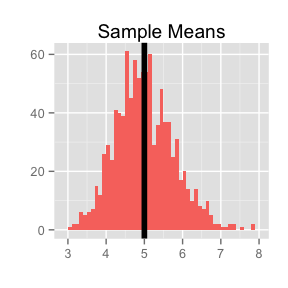
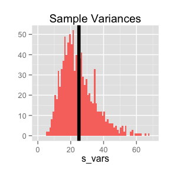
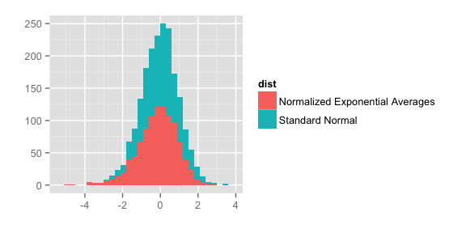

Overview
--------

This study compares the exponential distribution with the Central Limit Theorem (CLT). The CLT says that as sample size increases, the distribution of averages of iid variables (given they are normalized) approaches a standard normal distribution. Here, we use the exponential distribution to explore the CLT.

The exponential distribution is useful for modeling the time elapsed between events that occur at a given rate. There is only one parameter, the rate parameter λ. Both the mean and the standard deviation of the exponential distribution are 1/λ.

Simulations
-----------

Here, we conduct 1000 simulations (nsim = 1000) each with a sample size of 40 exponentials (n = 40). Our goals are to:

1.  Show the sample mean and compare it to the theoretical mean of the distribution.

2.  Show how variable the sample is (via variance) and compare it to the theoretical variance of the distribution.

3.  Show that the distribution is approximately normal.

``` r
# Simulation parameters
lambda = 0.2
n = 40
nsim = 1000

# Simulate & store sample means, standard deviations, and variances
sim <- matrix(rexp(n*nsim,lambda), n, nsim)
s_means <- apply(sim, 2, mean)
s_sds <- apply(sim, 2, sd)
s_vars <- s_sds^2

# Obtain 1000 standard normal values for comparison
zdist <- rnorm(nsim)
```

Sample Mean versus Theoretical Mean
-----------------------------------

The mean of the exponential distribution is given by 1/λ. Given that λ = 0.2 for our study, the theoretical mean is equal to 5. The histogram below shows the spread of 1000 sample means we simulated earlier.

``` r
require(ggplot2)

t_mean <- 1/lambda
qplot(s_means, geom = "histogram", binwidth = 0.1, fill = "red",
      main = "Sample Means", ylab = "", xlab = "") + geom_vline(xintercept = t_mean,
      lwd = 2) + theme(legend.position = "none")
```
<p align="center">

</p>

The black vertical line centered at 5 represents the theoretical mean of the distribution. The distribution of sample means peaks around 5 as well. The distribution of sample means resembles a normal distribution.

Sample Variance versus Theoretical Variance
-------------------------------------------

The variance of the exponential distribution is given by 1/λ^2. Given that λ = 0.2$ for our study, the theoretical variance is equal to 25. The histogram below shows the spread of 1000 sample variances we simulated earlier.

``` r
t_var <- (1/lambda^2)
qplot(s_vars, geom = "histogram", binwidth = 1, fill = "red", main = "Sample Variances",
      ylab = "", xylab = "", xlim = c(0, 70)) + geom_vline(xintercept = t_var,
      lwd = 2) + theme(legend.position = "none")
```
<p align="center">

</p>

The black vertical line centered at 25 represents the theoretical variance of the distribution. The distribution of sample variances peaks around 25 as well. The distribution of sample variances does not resemble a normal distribution.

Distribution
------------

Since we have run a large number of simulations (1000), our distribution of normalized averages should look more like that of the standard normal distribution, according to the CLT. The code below normalizes the sample means and plots a histogram to compare it with 1000 standard normal samples.

``` r
# Normalize the sample means & assemble into data frame
avgmean <- mean(s_means)
n_means <- (s_means - avgmean)/sqrt(s_vars/n)
compare <- data.frame(vals = c(n_means, zdist),
        dist = c(rep("Normalized Exponential Averages", nsim),
        rep("Standard Normal", nsim)))
Â
# Histogram
qplot(vals, data = compare, fill = dist, xlab = "", ylab = "", binwidth = 0.3)
```

<p align="center">

</p>

This histogram shows that the CLT holds true for our 1000 exponential simulations. The overall shapes of the two datasets peak around the same mean and taper with similar standard deviations.
